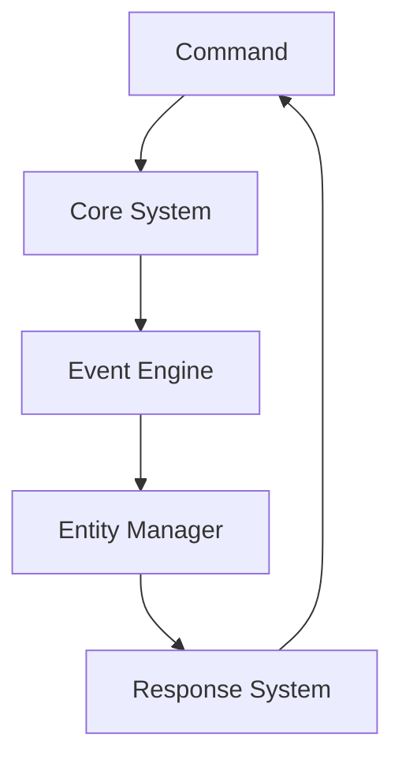

# ⚙️ Automation Systems Lab


---

## 🧠 About

Automation Systems Lab is a simulation project focused on event-driven systems, automation logic, and interactive entity behavior.

The goal is to simulate how real software systems (like backend engines or game systems) work internally.

---

## 🧠 Core Concept

Everything in the system follows an event-driven loop:

```text

Action → Core System → Event → Entity → Response → Loop
```
---

🏗️ System Architecture

### 📌 Main Flow



---

## 🔁 Execution Flow

The system works in cycles:

1. User triggers a command
2. System processes input
3. Event is generated
4. Entity reacts
5. Response is returned
6. Cycle repeats if needed

---

## 📁 Project Structure
automation-systems-lab/
│
├── docs/         # Documentation
├── src/          # Core logic
├── tests/        # Simulations
├── assets/       # Diagrams & visuals
├── README.md
├── CHANGELOG.md
├── LICENSE
└── .gitignore

---

## 📚 Documentation
/docs/architecture.md → system architecture
/docs/fluxo-sistemas.md → execution flow
/docs/regras-gerais.md → system rules

---

## 🔥 Features
Event-driven architecture
Modular system design
Entity behavior simulation
Automation logic system
Scalable structure

---

## 🧭 Roadmap
 Visual dashboard for system flow
 Advanced NPC behavior engine
 Plugin-based architecture
 Real-time event monitoring

 ---

## 👨‍💻 Author

Kevin Tan

## 📜 License

This project is licensed under the MIT License.

See the full license in the [LICENSE](LICENSE) file.
